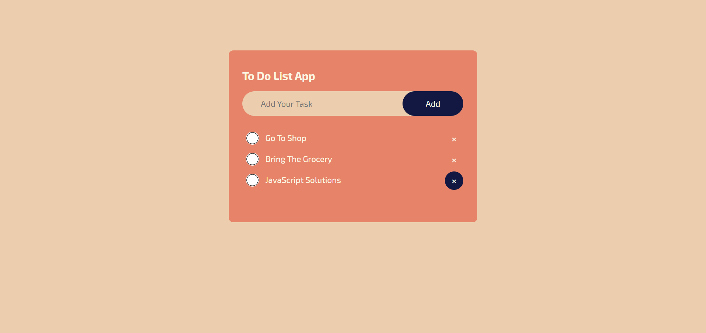

# To Do App

This is a simple To Do List application built using HTML, CSS, and JavaScript. It allows users to add, check off, and delete tasks, with data persistence using `localStorage`.

## Features

- Add tasks to the list.
- Mark tasks as completed.
- Delete tasks from the list.
- Data persistence using `localStorage`.

## Technologies Used

- HTML
- CSS
- JavaScript

## Usage

1. Clone the repository or download the source code.
2. Open `index.html` in your browser.
